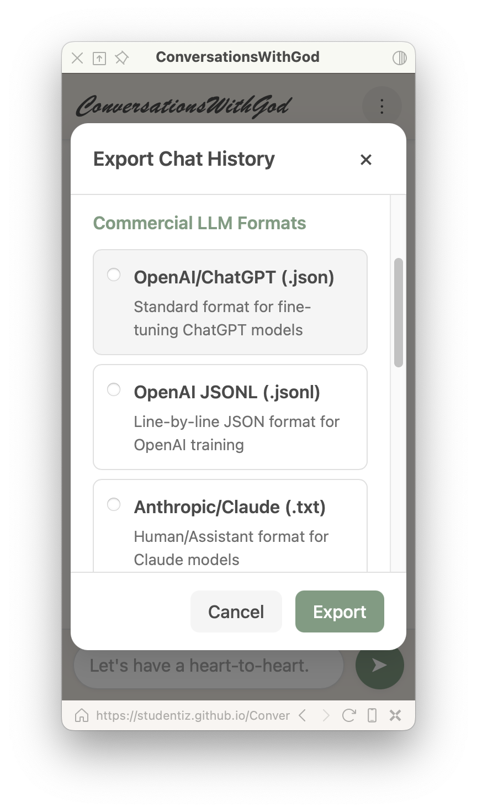

# ✨ ConversationsWithGod

  

  <i>"Meaning is not something we find, but something we create." — Alfred Adler</i>

## 🚀 Getting Started

No installation required!

1. Visit [https://studentiz.github.io/ConversationsWithGod/](https://studentiz.github.io/ConversationsWithGod/)
2. Start your conversation
3. Alternate between you (the seeker/student) and your inner wisdom (God)

Or download the HTML file and open it locally in any browser.

## 🪞 A Mirror for Your Soul

ConversationsWithGod is a simple but profound tool for having meaningful conversations with yourself. Frame your thoughts as a dialogue between a seeker and the divine – or however you choose to imagine your higher self.

Unlike traditional journal apps or AI chatbots, this is a space for genuine self-reflection. You play both parts in the conversation, allowing your own wisdom to emerge through the dialogue.

  

## 💭 Why This Exists

> "Know thyself." — Ancient Greek aphorism

We all need space to process our thoughts, ask deep questions, and listen to our inner wisdom. This tool provides a structured way to externalize that internal dialogue, making it easier to explore your own beliefs, challenges, and insights.

## ✨ Features

- **🍃 Pure Simplicity**: Single HTML file, no installation, works offline
- **🔒 Complete Privacy**: All conversations stay on your device
- **👁️ Ephemeral Memory**: Messages naturally fade and blur over time, mimicking real memory
- **🎨 Beautiful Interface**: Clean, paper-like design with light and dark modes
- **💾 Export Options**: Save your conversations in multiple formats
- **🤖 LLM Training Ready**: Export in formats compatible with various AI models
- **📱 Fully Responsive**: Works on desktop and mobile devices

## 🔒 Privacy

Your conversations are stored only on your device using browser localStorage. Nothing is ever sent to a server. There are no analytics, no tracking, and no cookies. Your thoughts remain entirely your own.

### Natural Privacy Protection

  

Rather than relying on passwords or encryption, ConversationsWithGod implements privacy the way human memory works:

- **Time-Based Fading**: Older messages gradually become blurry and fade away
- **Five Stages of Aging**: Messages progress through increasing levels of obscurity
- **Natural Security**: Anyone glancing at your screen sees only your recent thoughts clearly
- **No Permanent Record**: The fading visual effect creates a sense of impermanence

This design reflects how memories and conversations naturally fade with time, providing both privacy and encouraging a focus on the present moment.

## 📝 How To Use

1. **🙋 Start a dialogue**: Type your question or thought as yourself
2. **💫 Respond as wisdom**: The next message automatically switches roles
3. **🔄 Continue the conversation**: Alternate between the two perspectives
4. **⚙️ Adjust settings**: Change font size or toggle dark mode as needed
5. **📤 Export when ready**: Save your conversations for reference or training

## 🧠 Exporting for AI Training

Your self-conversations can be valuable training data for personalizing AI models. ConversationsWithGod supports exporting in formats compatible with most major LLM platforms:

- **🟢 OpenAI/ChatGPT** (JSON, JSONL)
- **🟣 Anthropic/Claude** (Human/Assistant format)
- **🔵 Meta/LLaMA** (Instruction format)
- **🟠 ShareGPT** (Community format)
- **🟡 Alpaca** (Instruction tuning format)
- **⚪ Plain Text** (Universal format)

  
  

## 🕊️ The Philosophy Behind It

> "The kingdom of God is within you." — Luke 17:21

This tool is built on the belief that we all have access to profound wisdom within ourselves. By creating space for dialogue, we can access parts of our consciousness that often go unheard in the noise of everyday thinking.

Whether you see this higher wisdom as God, your higher self, universal consciousness, or simply your own deeper insight doesn't matter. What matters is creating the space to listen.

## ⭐ Share the Light

> "A candle loses nothing by lighting another candle." — Father James Keller

In a world filled with noise and distraction, tools for inner reflection become precious sanctuaries. If ConversationsWithGod has helped bring clarity, peace, or insight to your life, consider helping others find it too:

- **⭐ Star this repository** to show your appreciation and help others discover it
- **🔄 Fork it** if you'd like to build upon it or customize it for your needs
- **🌱 Share it** with friends who might be seeking space for deeper reflection
- **💬 Tell your story** in the repository discussions about how it has helped you

Every star, fork, and share helps this little light reach more seekers in a digital landscape that often optimizes for engagement over reflection. Together, we can create more spaces for meaningful inner dialogue.

  

## 👥 Contributing

Contributions are welcome! Feel free to open issues or submit pull requests on the [GitHub repository](https://github.com/studentiz/ConversationsWithGod).

---

  <i>"It is not what happens to us that determines our lives, but how we interpret and respond to it." — Alfred Adler</i>

  Made with ❤️ for seekers everywhere

